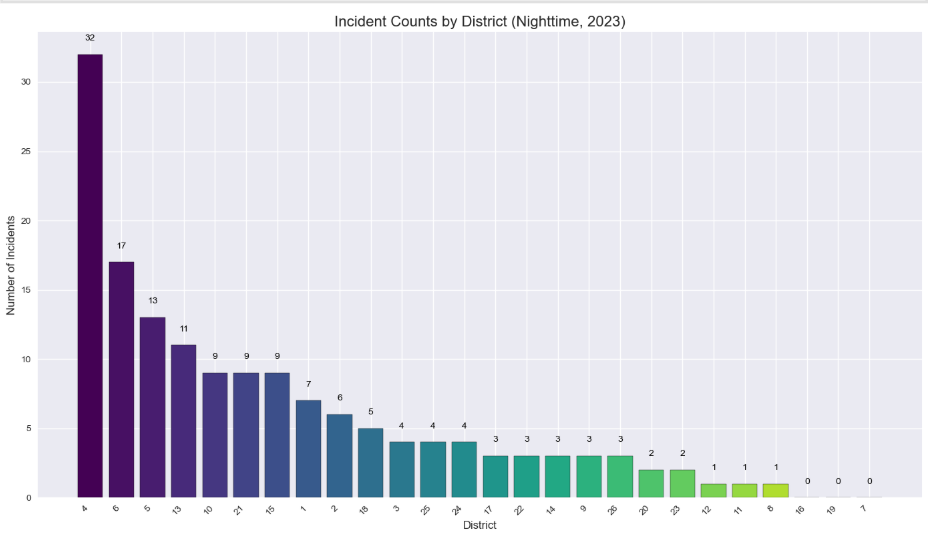
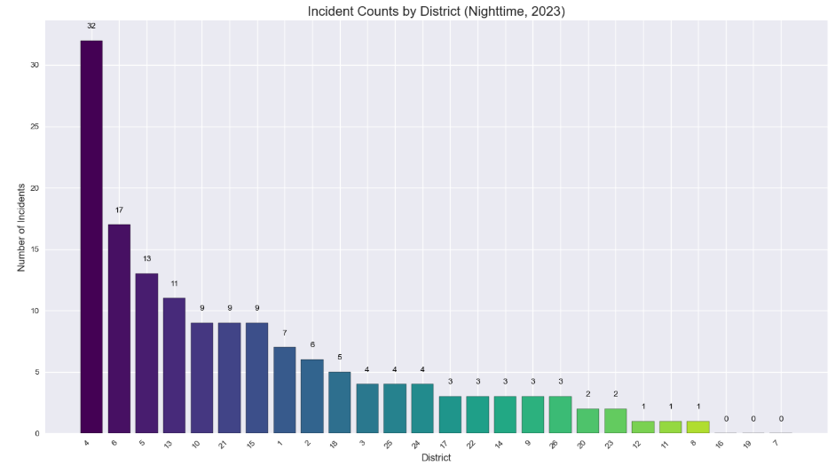
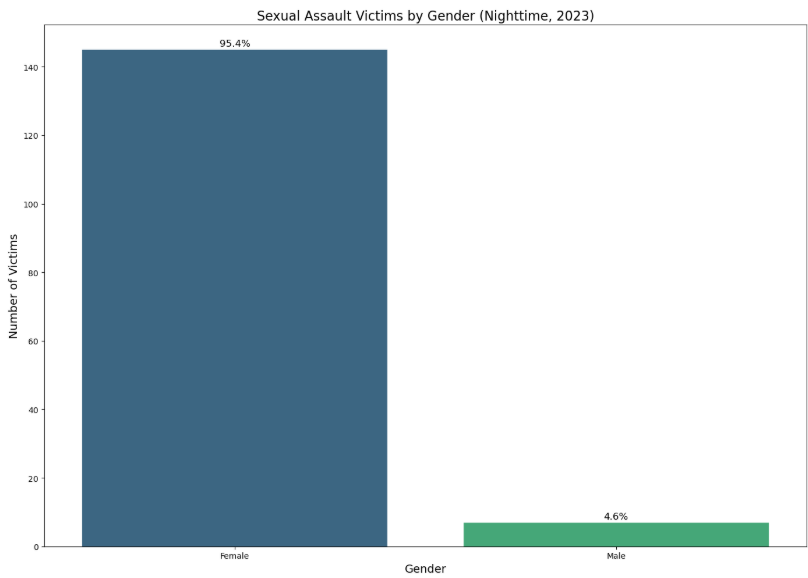
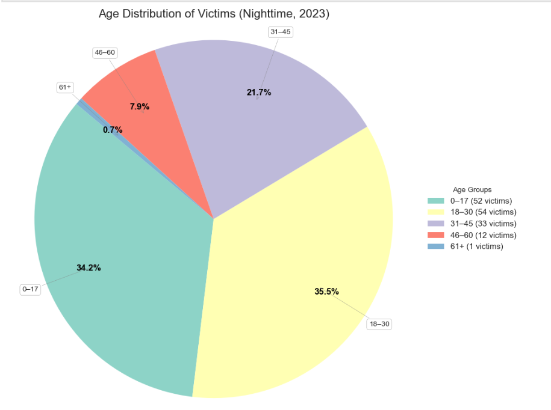
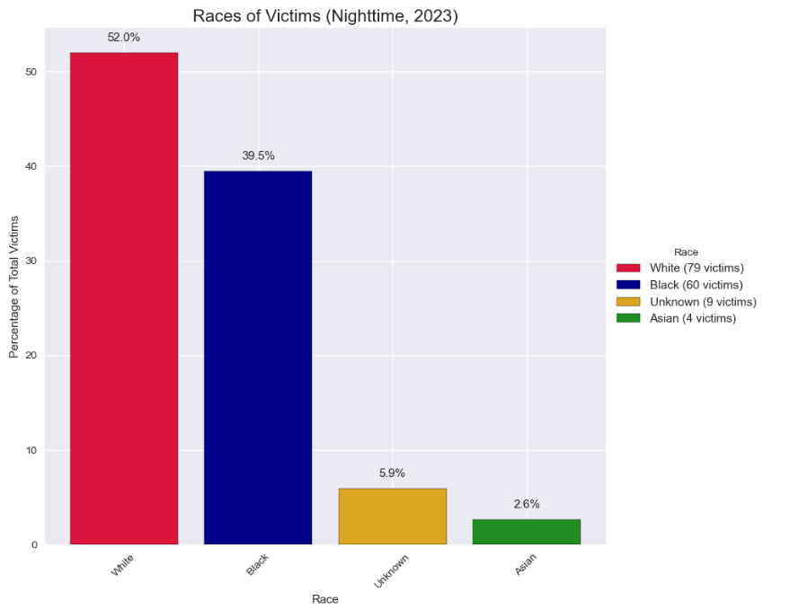
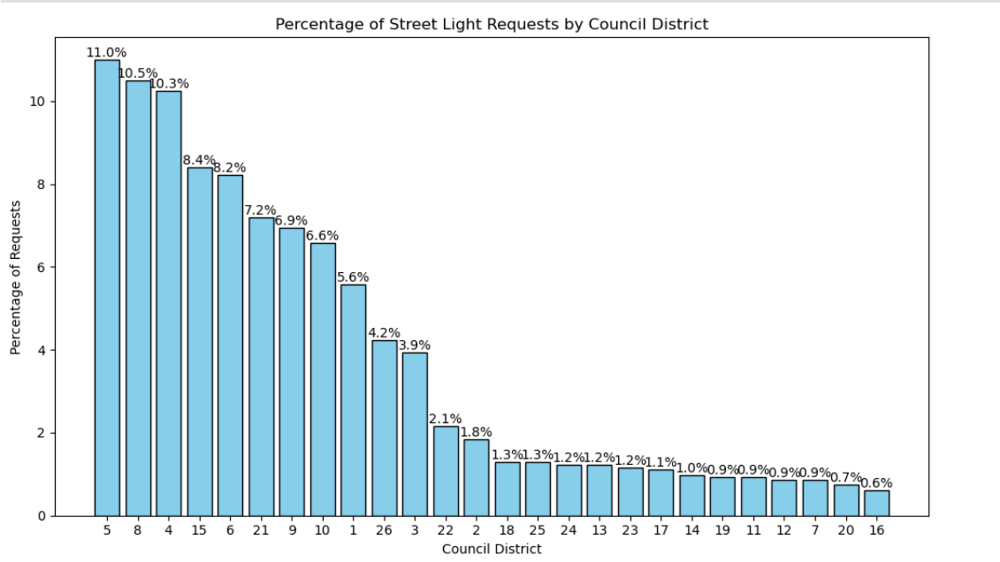
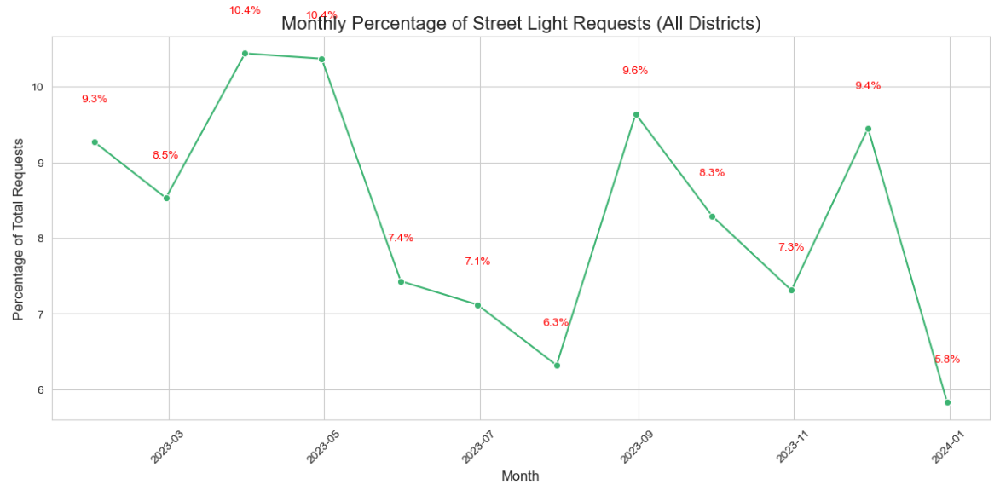
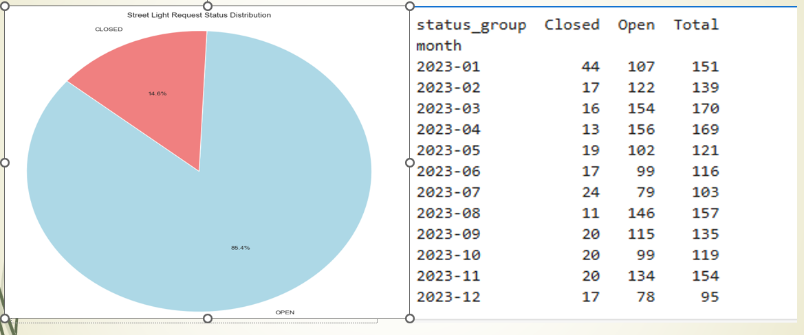
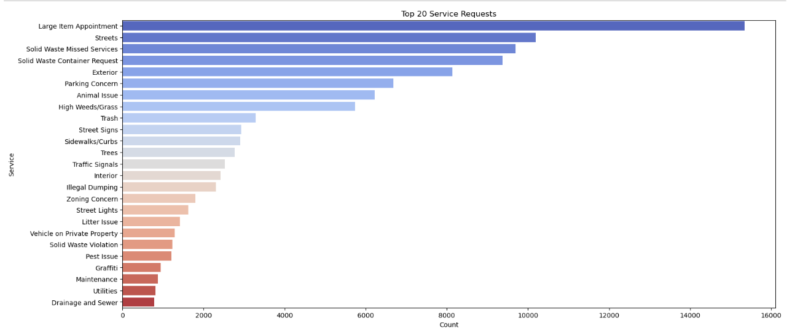
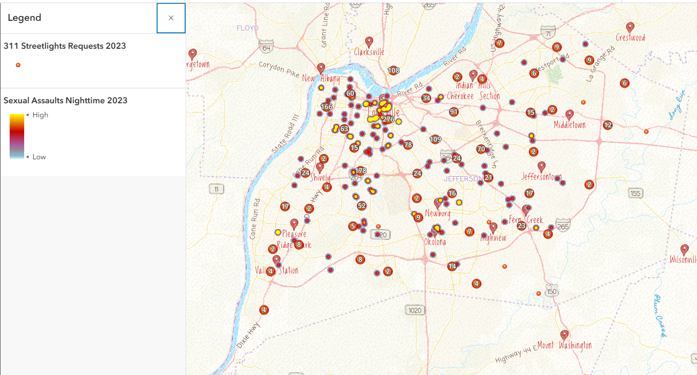

# Street Lighting's Impact on Urban Sexual Assaults in Louisville Metro (2023)

## Introduction

This project investigates the relationship between street lighting infrastructure and sexual assault rates in Louisville, Kentucky during 2023. The analysis combines data from city 311 service requests for streetlight maintenance with official sexual assault crime reports to examine whether areas with higher concentrations of streetlight requests correlate with sexual assault patterns, particularly during nighttime hours.

The project aims to:
- Analyze the geographic and temporal distribution of sexual assault incidents across council districts
- Examine streetlight infrastructure requests and their patterns across Louisville
- Explore potential correlations between streetlight density and assault rates
- Provide data-driven insights for urban safety planning and resource allocation

## Installation

### Prerequisites
- Python 3.8 or higher
- Jupyter Notebook or Jupyter Lab
- pip or conda package manager

### Required Dependencies

The project requires the following Python packages:
```
pandas
numpy
scikit-learn
imbalanced-learn
matplotlib
plotnine
seaborn
joblib
category-encoders
xgboost
lightgbm
scipy
```

### Setup Instructions

1. Clone the repository:
```bash
git clone <repository-url>
cd Street-lighting-impact-on-urban-sexual-assaults-in-Louisville-Metro-2023-main
```

2. Create a virtual environment (recommended):
```bash
python -m venv venv
venv\Scripts\activate  # On Windows
# or
source venv/bin/activate  # On macOS/Linux
```

3. Install required packages:
```bash
pip install pandas numpy scikit-learn imbalanced-learn matplotlib plotnine seaborn joblib category-encoders xgboost lightgbm scipy
```

4. Ensure you have the following data files in the project directory:
   - `assault incidents data.csv` - Sexual assault incident records
   - `311_2023.csv` - City 311 service requests (including streetlight requests)

## Usage

The project consists of three main Jupyter notebooks that should be run in sequence:

### 1. Sexual Assaults Analysis (`sexual assaults analysis.ipynb`)
This notebook performs exploratory data analysis on sexual assault incidents:
- Loads and cleans the assault incident dataset
- Filters for 2023 incidents and nighttime occurrences
- Analyzes assault patterns by:
  - Gender of victims
  - Age distribution
  - Geographic distribution (council districts)
  - Temporal trends (monthly patterns)
  - Race/age demographics

**Run:**
```bash
jupyter notebook "sexual assaults analysis.ipynb"
```

### 2. Street Lights Analysis (`streetlights analysis.ipynb`)
This notebook analyzes streetlight infrastructure and maintenance requests:
- Loads and processes the 311 service request data
- Filters for streetlight-related requests
- Analyzes streetlight request patterns by:
  - Council district distribution
  - Monthly trends
  - Request frequency and status
  - Top service request categories

**Run:**
```bash
jupyter notebook "streetlights analysis.ipynb"
```

### 3. Combined Analysis (`Combined Analysis.ipynb`)
This notebook merges and correlates the two datasets:
- Combines assault and streetlight data at the district and monthly level
- Performs statistical analysis including:
  - Correlation tests (Pearson, Spearman, Kendall)
  - Normality assessments (Shapiro-Wilk tests)
  - LOWESS regression analysis
  - Heatmaps showing the relationship between streetlights and assaults
  - Identifies districts with both high streetlight requests and high assault rates

**Run:**
```bash
jupyter notebook "Combined Analysis.ipynb"
```

## Code Overview

### Project Structure
```
Street-lighting-impact-on-urban-sexual-assaults-in-Louisville-Metro-2023-main/
├── sexual assaults analysis.ipynb        # Sexual assault data analysis
├── streetlights analysis.ipynb           # Streetlight infrastructure analysis
├── Combined Analysis.ipynb               # Integrated analysis and correlation study
├── images/                               # Output visualizations and charts
├── processed_data/                       # Intermediate processed datasets
├── artifacts/                            # Generated reports and outputs
└── report_streetlightproject.pdf         # Summary report
```

### Data Processing Workflow

1. **Data Loading & Cleaning**
   - Both notebooks load raw CSV files
   - Handle missing values and duplicates
   - Convert date/time columns to proper datetime formats

2. **Feature Engineering**
   - Extract temporal features (hour, month, year) from timestamps
   - Create nighttime flag for assault incidents
   - Normalize district identifiers across datasets

3. **Exploratory Analysis**
   - Descriptive statistics for each variable
   - Distribution analysis with histograms and Q-Q plots
   - Categorical summaries by district, gender, age, and time

4. **Correlation & Regression**
   - Statistical correlation analysis between streetlight and assault percentages
   - Normality testing to determine appropriate statistical tests
   - LOWESS (Locally Estimated Scatterplot Smoothing) regression visualization

5. **Visualization**
   - Uses plotnine (ggplot2-style grammar of graphics) for publication-quality plots
   - Heatmaps showing district-level relationships
   - Time series plots for temporal trends
   - Distribution plots and Q-Q plots for statistical validation

### Key Variables

**Sexual Assault Dataset:**
- `Offense Start Date` - Date and time of incident
- `Sex` - Gender of victim
- `Age` - Age of victim
- `COUNDIST` - Council district
- `Case Status` - Investigation status
- `Location Category` - Type of location (street, home, etc.)

**Streetlight Dataset (311 Service Requests):**
- `requested_datetime` - Date/time of request
- `service_name` - Type of service request
- `service_request_id` - Unique request identifier
- `council_district` - Geographic council district
- `status` - Request status (open, closed, in-progress)

## Images Folder

All visualizations and charts generated by the analysis notebooks are saved in the `images/` folder. This includes:

- **assaults-age-distribution.png** - Age distribution of sexual assault victims
- **assaults-by-districts.png** - Assault incidents by council district
- **assaults-gender.png** - Gender breakdown of assault victims
- **Combined Heatmap for Streetlights & Sexual Assaults.png** - Heatmap showing correlation between streetlight requests and assault rates by district and month
- **Race-age-of assaults.png** - Race and age demographics of assault victims
- **robust-regression.png** - Regression analysis visualization
- **streetlights-requests-by-districts.png** - Distribution of streetlight requests across council districts
- **status-request-streetlights.png** - Status breakdown of streetlight service requests
- **trends-streelighting-requests.png** - Temporal trends in streetlight requests
- **top20-service-requests.png** - Top 20 most common 311 service request types

When modifying or updating the analysis, ensure that new visualizations are saved to this folder with descriptive filenames for easy reference and documentation.

### Key Visualizations

#### Sexual Assault Analysis


**Geographic Distribution of Sexual Assaults** - Distribution of sexual assault incidents across Louisville's council districts, showing geographic hotspots for crime during 2023.


**Counts of Assaults by Districts** - Detailed count analysis of sexual assault incidents by council district, providing quantitative comparison of crime distribution across neighborhoods.


**Victim Gender Distribution** - Gender breakdown of sexual assault victims in Louisville during 2023, highlighting the predominantly female victim population and relative proportions.


**Victim Age Distribution** - Age distribution analysis of sexual assault victims, revealing which age groups are most affected by sexual violence in Louisville.


**Race and Age Demographics** - Combined analysis of victim demographics showing the intersection of race and age in sexual assault victimization patterns across Louisville.


**Racial Distribution of Victims** - Detailed breakdown of assault victim racial demographics, providing insights into disparities in sexual violence victimization across racial groups.


**Assault Case Status Distribution** - Overview of the status of reported sexual assault cases, showing investigation progress and case resolution rates.

#### Streetlight Infrastructure Analysis


**Streetlight Requests by Council District** - Geographic distribution of streetlight maintenance requests across council districts, indicating areas with lighting infrastructure concerns and service demands.


**Temporal Trends in Streetlight Requests** - Monthly trends showing seasonal patterns and overall demand for streetlight maintenance and repair services throughout 2023.


**Streetlight Request Status Distribution** - Breakdown of service request statuses (open, closed, in-progress) for streetlight-related 311 requests, showing municipal response efficiency.


**Top 20 Most Common 311 Service Requests** - Comparative analysis of the most frequent service request types in Louisville, with streetlight requests prominently featured.

#### Combined Correlation Analysis


**Heatmap: Streetlights vs Sexual Assaults** - Comprehensive heatmap showing the temporal and geographic relationship between streetlight service requests and sexual assault incidents across districts and months, revealing potential correlations.


**Robust Regression Analysis** - Statistical regression model showing the relationship between streetlight request density and sexual assault rates, with confidence intervals and trend visualization.

## Results Summary

The analysis reveals:
- Significant geographic variation in both streetlight requests and assault incidents across council districts
- Temporal clustering of assaults during nighttime hours
- Potential associations between areas with high streetlight concerns and elevated assault rates
- Demographic patterns in victimization across age, gender, and race

## Methodology Notes

- **Time Period**: 2023
- **Nighttime Definition**: The timeframe between the sunset and the sunrise of the following day.
- **Geographic Unit**: Council districts in Louisville metro area
- **Statistical Tests**: Shapiro-Wilk (normality), Pearson/Spearman correlations, LOWESS regression

## Dependencies & Libraries

- **pandas**: Data manipulation and analysis
- **numpy**: Numerical computing
- **matplotlib & seaborn**: Statistical visualization
- **plotnine**: ggplot2-inspired grammar of graphics for Python
- **scikit-learn**: Machine learning preprocessing and analysis
- **scipy**: Statistical functions and tests
- **joblib**: Efficient computation and caching

## Report

A comprehensive PDF report of the analysis findings is available in `report_streetlightproject.pdf`.

## Future Work

Potential extensions to this analysis:
- Predictive modeling for assault risk based on streetlight density
- Temporal analysis of assault trends before/after streetlight improvements
- Integration of additional socioeconomic variables
- Machine learning models for district-level risk assessment
- Network analysis of spatiotemporal patterns

## Contact & Attribution

For questions or contributions regarding this analysis, please contact the project team or submit an issue to the repository.

---

Last Updated: December 2023
Data Source: Louisville Metro Police Department & 311 Service Requests

